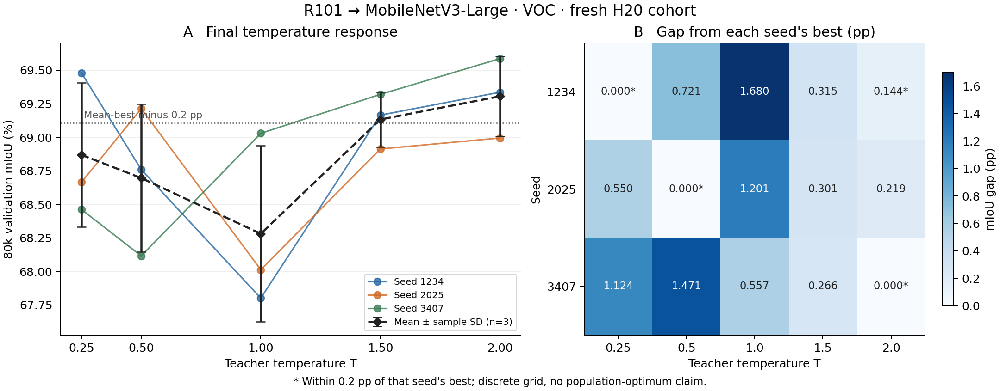
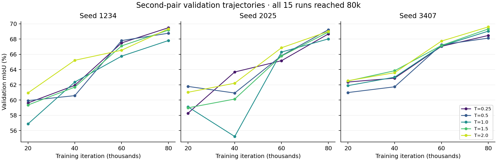

# 第二教师—学生模型对：最终结果

R101 → MobileNetV3-Large 在 VOC Aug 上的第一阶段已于 **2026-09-22 11:52（北京时间）完成**：五个温度 × 三个 paired seeds，共 15 条 fresh 80k。按预设规则不触发第二阶段，未运行 T=0.75、1.25。

**T=2.0 的三 seed 平均 mIoU 最高，为 69.3056%；δ=0.2 个百分点的均值近优集合为 {1.5, 2.0}。三个 seed 的网格赢家分别为 0.25、0.5、2.0。** 因此，本轮五点网格内没有在三个 seed 上重复获胜的唯一温度。

## 温度响应

以下为 80k final validation mIoU（%）。SD 为三个 seed 的样本标准差，不是置信区间。

| T | seed 1234 | seed 2025 | seed 3407 | 均值 | 样本 SD |
|---:|---:|---:|---:|---:|---:|
| 0.25 | 69.480413 | 68.664455 | 68.462300 | 68.869056 | 0.539013 |
| 0.5 | 68.759316 | 69.214028 | 68.115371 | 68.696238 | 0.552038 |
| 1.0 | 67.800862 | 68.012673 | 69.029480 | 68.281005 | 0.656793 |
| 1.5 | 69.165152 | 68.912899 | 69.320095 | 69.132715 | 0.205527 |
| 2.0 | 69.335973 | 68.994683 | 69.586152 | 69.305603 | 0.296902 |

T=2.0 相对 T=1.5 的同 seed 差值为 +0.170821、+0.081784、+0.266057 个百分点，平均 +0.172887 pp，小于预设的 0.2 pp 容差。T=2.0 在三条配对比较中均高于 T=1.5，但二者仍同时属于按均值定义的实用近优集合。该集合不是统计等效性或总体最优温度的置信集合。

温度也并非完全无影响：T=2.0 相对 T=1.0 的平均差为 +1.024598 pp，三个 seed 的差值均为正。结果支持区分“部分温度较差”和“是否存在跨 seed 唯一可重复的赢家”。

| seed | 样本赢家 T | 距该 seed 最佳值不超过 0.2 pp 的温度 |
|---:|---:|---|
| 1234 | 0.25 | {0.25, 2.0} |
| 2025 | 0.5 | {0.5} |
| 3407 | 2.0 | {2.0} |

## 补点决定

预设补点条件为：第一阶段均值赢家是 T=1.0；或赢家为 T=0.5/1.5，且内部候选 {0.5,1.0,1.5} 至少两个点进入均值近优集合。本轮赢家为 T=2.0，内部近优点仅有 1.5，因此条件不满足，基础 15 条即为本轮完整实验。

T=2.0 位于测试范围的上边界，结果不能确定更大温度下的响应，也不能证明 2.0 是连续温度空间的最优点。这里报告的是预设五点网格中的样本结果。

## 与第一模型对及 CoVar 的关系

| 项目 | 原 P7：R101 → Small | 本轮：R101 → Large |
|---|---|---|
| 候选网格 | 七点，含 0.75、1.25 | 五点，未触发补点 |
| 均值最高温度 | 1.5 | 2.0 |
| δ=0.2 pp 均值近优集合 | {0.5, 1.5} | {1.5, 2.0} |
| 三 seed 网格赢家 | 1.5、0.25、0.75 | 0.25、0.5、2.0 |

两个模型对的描述性结果均未出现跨三个 seed 重复的唯一赢家。本轮对应预设结果 A 的网格诊断，但不能由此推出“最优蒸馏温度通常不可识别”。P7 使用双卡 DDP，本轮使用单卡，且软件、硬件与候选网格不同；学生容量对响应变化的独立作用尚未被隔离。

沿用原 P7A 的固定 teacher CoVar 统计，两个近优集合在 T=1.5 的坐标上相交：r_c=0.050836446、r_v=0.243055924。本轮另一近优点 T=2.0 的坐标为 r_c=0.102252647、r_v=0.251133329。上述为同一 teacher 的既有坐标映射，不是对新 student 的重新估计。

虽然两个网格的均值赢家不同且有共同的近优 CoVar 点，同一 teacher 在同 T 下共享同一坐标，因此这种重合本身不足以验证跨模型对的温度选择规则。结果 C 中关于实用迁移能力的主张仍未得到检验。

分类 KD 的温度与 optimizer、teacher 训练等组件的交互已由 [Frank and Davis (2026)](https://arxiv.org/abs/2603.02430) 系统研究。本实验增加的是 dense prediction 中的配对温度响应与 CoVar 坐标描述。VOC validation 同时用于温度选择和上述评估，未提供独立测试集上的选择收益。

## 完整性与复现

独立复核通过：15 条 80k 结束记录、60 个验证点及 CSV 行与原始日志一致；均值、样本 SD、逐 seed 赢家、近优集合和补点决定均重算一致。60 份里程碑检查点和 15 份 latest 状态均可在 CPU 加载，内部 iteration 与预期一致，student 与 optimizer 张量有限，optimizer 和 RNG 状态存在。启动时锁定的源码和权重 SHA-256 保持一致，第一阶段归档与最终原始报告一致。完整证据见 [completion_audit.json](completion_audit.json)。

协议沿用每条单 GPU、全局 batch=16、crop=512×512、workers=4、SGD lr=0.02、momentum=0.9、weight decay=0.0001 和原 poly schedule。损失为 CE+KD，teacher-only T、student T=1、无 T² 补偿。旧 H100 结果不并入本批次，已完成的 P8 CE 未重跑。

可下载文件：[逐条原始结果](P9_temperature.csv)、[完整机器可读报告](P9_temperature.json)、[阶段一归档](P9_stage1.json)、[补点决定](stage2_decision.json)、[实际协议](protocol.json)、[温度响应 PDF](temperature_response.pdf)、[验证轨迹 PDF](validation_trajectories.pdf)。
